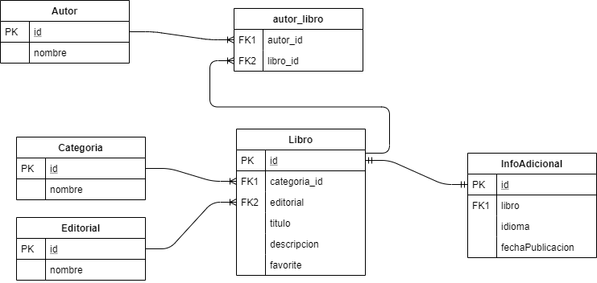

# tallerJPASpringData
Vamos a intentar dar detalle del estándar JPA, como mapear las entidades y crear distintos tipos de relaciones.
Adicionalmente, mediante [Spring Data JPA](https://docs.spring.io/spring-data/jpa/docs/current/reference/html/#repositories) revisaremos distintas meneras de obtener la información del modelo de datos creado.

## JPA
Japa Persistence API(JPA) es la propuesta estándar que ofrece Java para implementar un Framework Object Relational Mapping (ORM), que permite interactuar con la base de datos por medio de objetos, de esta forma, JPA es el encargado de convertir los objetos Java en instrucciones para el Manejador de Base de Datos (MDB).
JPA es una especificación y no un Framework como tal, existen distintas implementaciones de la especificación, como por ejemplo:
 - Hibernate
 - ObjectDB
 - EclipseLink
 - OpenJPA
### Entidades
Una entidad de persistencia (entity) es una clase de Java ligera, cuyo estado es persistido de manera asociada a una tabla en una base de datos relacional. Las instancias de estas entidades corresponden a un registro (conjunto de datos representados en una fila) en la tabla. 
JPA debe de ser capaz de identificar que clases son entidades para de esta forma poderlas administrarlas. Con la anotación @Entity, que se define a nivel de clase, conseguimos indicar a JPA que la clase es una entidad. Veamos un ejemplo:
```sh
@Entity
public class Autor {

    /**
     * Id.
     */
    @Id
    private int id;

    /**
     * Nombre del autor.
     */
    private String nombre;
}
```
La clase Autor nos indica que existe una tabla llamada autor, que tiene dos columnas id y nombre. La columna id es el ID de la tabla.
####  Anotacion @Table
Esta anotación indica la tabla contra la que se mapea la entidad. Además tiene estas propiedades:

 - name: se utiliza para poner el nombre real de la tabla en la base de datos.
 - schema: se utiliza para indicar el schema en el que se encuentra la tabla. Esta propiedad sólo sería necesaria si la tabla se encuentre en un schema diferente al de nuestro usuario de base de datos.
 - Indexes: JPA permite indicar los índices que tiene nuestra tabla.

```sh
@Entity
@Table(
    name = "Autor" , 
    schema = "tallerJPA", 
    indexes = {@Index(name = "name_index", columnList = "nombre",unique = true)}
)
public class Autor {

    /**
     * Id.
     */
    @Id
    private int id;

    /**
     * Nombre del autor.
     */
    private String nombre;
}
``` 
  Esta anotación no es obligatoria. El hecho de no ponerla supone que JPA determine que la tabla tiene el mismo nombre que la clase y está en el schema del usuario logado.
  
####  Anotacion @Column  
La anotación @Column nos permitirá definir aspectos sobre las columnas de nuestras tablas, como el nombre, la longitud, constrains, etc. 
En caso de no definir esta anotación en los atributos, JPA determinara el nombre de la columna de forma automática mediante el nombre del atributo, por lo que siempre es recomendable establecer esta anotación en todos los atributos de la clase y evitarnos problemas.

Las propiedades que podemos definirle a @Column son las siguientes:

 - name: Permite informar el nombre de la columna de la tabla con la que el atributo debe de mapear.
 - length: Define la longitud de la columna en caracteres(solo aplica para Strings).
 - insertable: Le indica a JPA si esa columna debe ser tomada en cuenta en los inserts, en caso de ser true, el valor será insertado, en caso contrario el valor será omitido y será colocado el valor default de la columna o null.
 - updatable: La columna se toma en cuenta para operaciones de Update.
 - nullable: Crea una restricción en la tabla (Not Null) para impedir que se inserten valores nulos. 
 - scale: Utilizada únicamente para columnas que deben tener decimales, como valore recibe el número de decimales.
 - unique: Creara una restricción en la tabla para que sea el valor de esa columna sea único. 

```sh
    /**
     * Nombre de la editorial.
     */
    @Column(name = "nombre", nullable = false, length = 150)
    private String nombre;
```   
### Relaciones
Las entidades pueden estar relacionadas con otras entidades. Estas relaciones son expresadas a través de meta datos objeto/relacional. Los meta datos del objeto/relacional pueden ser especificados directamente en el fichero de la propia clase usando anotaciones de Java  o en un documento descriptivo XML, el cual es distribuido junto con la aplicación.

####  Relaciones @OneToOne 

Las relaciones Uno a Uno (@OneToOne) infican que solo puede existir una y solo una relación con la Entidad de destino. De esta forma, la entidad marcada como @OnoToOne deberá tener una referencia a la Entidad destino(que no puede ser una colección). De la misma forma, la Entidad destino no podrá pertenecer a otra Instancia de la Entidad origen.

Entidad InfoAdicional

```sh
@Entity
public class InfoAdicional {

    /**
     * Id.
     */
    @Id
    private int id;

    .....

    /**
     * Objeto libro.
     */
    @OneToOne
    @JoinColumn(name = "libro", referencedColumnName = "id")
    private Libro libro;

}
```

Entidad Libro
```sh
@Entity
public class Libro {

    /**
     * Id.
     */
    @Id
    private Integer id;

    .....

    @OneToOne(mappedBy="libro")
    private InfoAdicional informacion;

}
```   
####  Relaciones @ManyToOne 

Las relaciones Muchos a Uno (@ManyToOne)  nos permite mapear una entidad con otra. Dispone de las siguientes propiedades:

 - Optional: indica si la relación es opcional, es decir, si el objeto puede ser null. Esta propiedad se utiliza optimizar las consultas. Si JPA sabe que una relación es opcional, entonces puede realizar un RIGHT JOIN  o realizar la consulta por separado, mientras que, si no es opcional, puede realizar un INNER JOIN  para realizar una solo consulta.
 - Cascade: Esta propiedad le indica que operaciones en cascada puede realizar con la Entidad relacionada, los valores posibles son ALL , PERSIST , MERGE , REMOVE , REFRESH , DETACH.
 - Fetch: Utilizada para determinar cómo debe ser cargada la entidad relacionada. Los posibles valores son:
    - EAGER (ansioso): Indica que la relación debe de ser cargada al momento de cargar la entidad.
    - LAZY (perezoso): Indica que la relación solo se cargará cuando la propiedad sea leída por primera vez.

Entidad Libro
```sh
@Entity
public class Libro {

    /**
     * Id.
     */
    @Id
    private Integer id;

    .....

    /**
     * Categoria ID.
     */
    @ManyToOne(optional = false, cascade = CascadeType.ALL, fetch = FetchType.EAGER)
    private Categoria categoria;
}

}
```

####  Relaciones @OneToMany 

En las relaciones Uno a Muchos (@OneToMany) tenemos un objeto principal y una colección de objetos de otra Entidad relacionados directamente.

Entidad Categoría
```sh
@Entity
public class Categoria {

    /**
     * Id.
     */
    @Id
    private int id;
    
    ....

    /**
     * Libros de la categoría
     */
    @OneToMany(mappedBy="categoria")
    private List<Libro> libros;
}
```
La propiedad mappedBy indica que es una relación bidireccional, es decir, la Entidad Libro tendrá también una relación hacia la Entidad Categoria.


####  Relaciones @JoinColumn 

Mediante la anotación @JoinColumn es posible personalizar las columnas que será utilizadas como uniones con otras tablas en las relaciones  @ManyToOne o @OneToOne.

Entidad Libro
```sh
@Entity
public class Libro {

    /**
     * Id.
     */
    @Id
    private Integer id;

    ......

    /**
     * Editorial.
     */
    @ManyToOne
    @JoinColumn(name = "editorial")
    private Editorial editorial;
}
```
De esta forma estamos indicando que Libro tendrá una columna llamada editorial, que estará relacionada con la tabla Editorial.

####  Relaciones @ManyToMany 

Las relaciones de Muchos a Muchos (@ManyToMany) se caracterízan por Entidades que están relacionadas con a muchos elementos de un tipo determinado, y que a su vez, estos últimos registros no son exclusivos de un registro en particular.
Es importante tener presente que en realidad este tipo de relaciones necesita de una tabla intermedia que relacione las dos entidades.

Entidad Libro
```sh
@Entity
public class Libro {

    /**
     * Id.
     */
    @Id
    private Integer id;

    ......

    /**
     * Autores.
     */
    @ManyToMany
    @JoinTable(name = "autor_libro",
    		   joinColumns = @JoinColumn(name = "libro_id"),
    		   inverseJoinColumns = @JoinColumn(name = "autor_id")
    		  )
    private List<Autor> autores;
}
```
La anotación @JoinTable nos permite definir la estructura de la tabla intermedia que contendrá la relación entre ambas entidades. Tiene las siguientes propiedades:

 - name: Nombre de la tabla que será creada físicamente en base de datos.
 - joinColumns: Corresponde al nombre para el ID de la Entidad donde creamos la relación(en este caso Libro).
 - inverseJoinColumns: Corresponde al nombre para el ID de la Entidad con la que se relaciones(en este caso Autor)

 ```sh
@Entity
public class Autor {

    /**
     * Id.
     */
    @Id
    private Integer id;

    ......
    
    /**
     * Libros.
     */
    @ManyToMany(mappedBy = "autores")
    List<Libro> libros;
}
```
Mediante el uso del mappedBy informamos que es una relación bidireccional.

## Modelo de Datos

Siguiendo el anterior patrón de creación de entidades y relaciones tenemos el siguiente modelo de datos para el ejemplo:
<p align="center">
    
</p>

## Acceso a datos/Creación de consultas

Para cada una de las entidades del modelo que queramos realizar consulta será necesario crear un interfaz anotado como @Repository.

 ```sh
@Repository
public interface InfoAdicionalRepository extends JpaRepository<InfoAdicional, Integer> {


}
```

Este repository nos proveerá automáticamente de una serie de métodos para obtener/permistir información sobre la entidad.

```sh 
 
 <S extends T> S save(S entity);         -- Realiza el guardado de información sobre una entidad. Si no tiene id realizará una inserción, si tiene realizará una actualización:
 Optional<T> findById(ID primaryKey);    -- Retorna la entidad correspondiente al id. 
 Iterable<T> findAll();                  -- Retorna una lista con todas las entidades.
 long count();                           -- Retorna el total de entidades.
 void delete(T entity);                  -- Elimina la entidad
 boolean existsById(ID primaryKey);      -- Retorna true si existe la entidad filtrando por id.
``` 

Para crear consultas personalizadas podemos hacer lo siguiente:

### Usando Query Methods

Estableciendo un nombre a un método describiendo que queremos obtener. Esto automáticamente ejecutará la consulta con los parámetros que hayamos establecido.

```sh 
@Repository
public interface LibroRepository extends JpaRepository<Libro, Integer> {

    public List<Libro> findByFavoriteTrue();

    public Optional<Libro> findByTitulo(String titulo);

    public  List<Libro> findByAutores_nombre(String nombre);

    public  List<Libro> findByAutores_nombreIgnoreCase(String nombre);

    public  List<Libro> findByAutores_id(Integer id);

    public  List<Libro> findByAutores_nombreAndCategoria_nombre(String autor, String categoria);
``` 

### Usando Query By Example

Para realizar una consulta con varios posibles combinaciones de filtros puede ser muy complejo el implementar todas las posibles métodos y filtrar por el que corresponda. Para solvertar esto, una posible solución es usar el método [Query By Example](https://docs.spring.io/spring-data/jpa/docs/current/reference/html/#query-by-example).
Para ello, habrá que extender nuestro repositorio a QueryByExampleExecutor<T> , por lo que nos proveerá de:

```sh 
@Repository
public interface LibroRepository extends JpaRepository<Libro, Integer>, QueryByExampleExecutor<Libro> {

  <S extends T> S findOne(Example<S> example);

  <S extends T> Iterable<S> findAll(Example<S> example);

```

Como ejemplo de uso:

```sh 
@Repository
		Categoria categoria = Categoria.builder()
									.id(4)
									.nombre("Romantica")
									.build();
		Libro libro = Libro.builder()
						.categoria(categoria)
						.build();

		Example<Libro> exLibro = Example.of(libro);

		List<Libro> libros = libroRepository.findAll(exLibro);

```

### Usando @Query 

Es posible definir la consulta a ejecutar al realizar la llamada a uno de los métodos de nuestro repositorio haciendo uso de [@Query](https://docs.spring.io/spring-data/jpa/docs/current/reference/html/#jpa.query-methods.at-query):

```sh
@Repository
public interface EditorialRepository extends JpaRepository<Editorial, Integer> {

	@Query("select e from Editorial e where e.nombre like %?1")
	List<Editorial> findByNombreEndsWith(String nombre);
  
	@Query(value = "SELECT * FROM EDITORIAL WHERE NOMBRE LIKE %?1", nativeQuery = true)
	List<Editorial> findNativeByNombreEndsWith(String nombre);

```

Se puede ejecutar una query mediante JPQL o como query nativa.

### Usando Specification 

También es posible construir una consulta programáticamente mediante [Specification](https://docs.spring.io/spring-data/jpa/docs/current/reference/html/#specifications). 
Para ello será necesario extender nuestro repositorio de JpaSpecificationExecutor<T>, por lo que podremos hacer uso de: 

```sh
List<T> findAll(Specification<T> spec);

```

Ahora, podremos construir las distintas especificaciones y combinarlas para relizar la consulta deseada.

Por ejemplo, para la entidad Autor, expendemos su repository:

```sh
@Repository
public interface AutorRepository extends JpaRepository<Autor, Integer>,JpaSpecificationExecutor<Autor> {


}

```

Se crea la especificación para filtrar los autores que tengan más de un libro:

```sh
public class AutorSpecification {

    public static Specification<Autor> filterMasDeUnLibro() {

        return new Specification<Autor>() {

            @Override
            public Predicate toPredicate(Root<Autor> root, CriteriaQuery<?> query, CriteriaBuilder cb) {
            	return cb.greaterThan(cb.size(root.get("libros")), 1);
            }

        };
    }

}

```
Para hacer uso de esta especificacion en una consulta.

```sh
	Specification<Autor> specificationAutor = Specification.where(AutorSpecification.filterMasDeUnLibro());

	List<Autor> autores = autorRepository.findAll(specificationAutor);

```

## Ejemplos

En este proyecto podrás encontrar ejemplos de las distintas formas de realizar consultas. Para su ejecución se han realizado JUnits para cada repositorio.
Mediante la anotación [@DataJpaTest](https://docs.spring.io/spring-boot/docs/current/api/org/springframework/boot/test/autoconfigure/orm/jpa/DataJpaTest.html) creada para permitir las pruebas unitarias de las clases Repository. Nos permite disponer de una base de datos en memoria y tener una transacción distinta para cada método.
Para la carga de los datos en las pruebas se ha hecho uso de la anotación @Sql de Spring que permite hacer uso de un determinado juego de datos para cada uno de los test. 